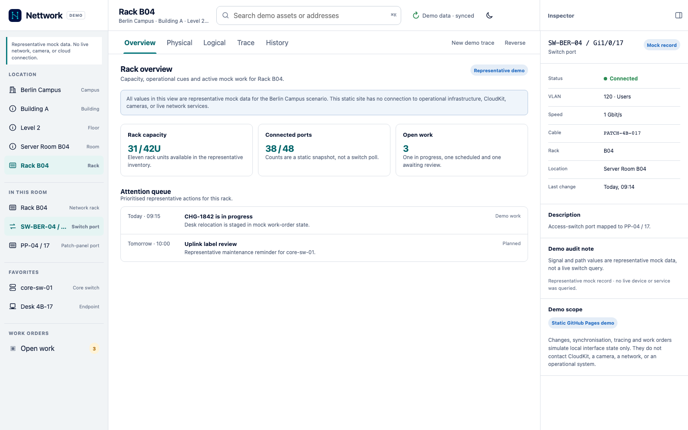
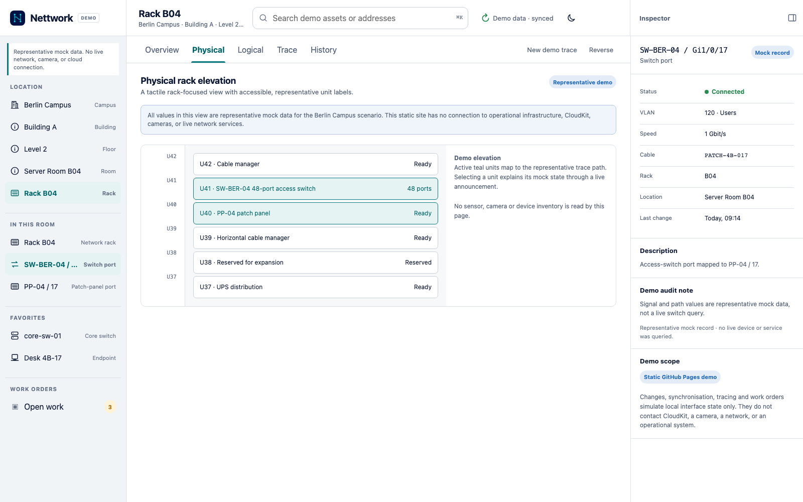
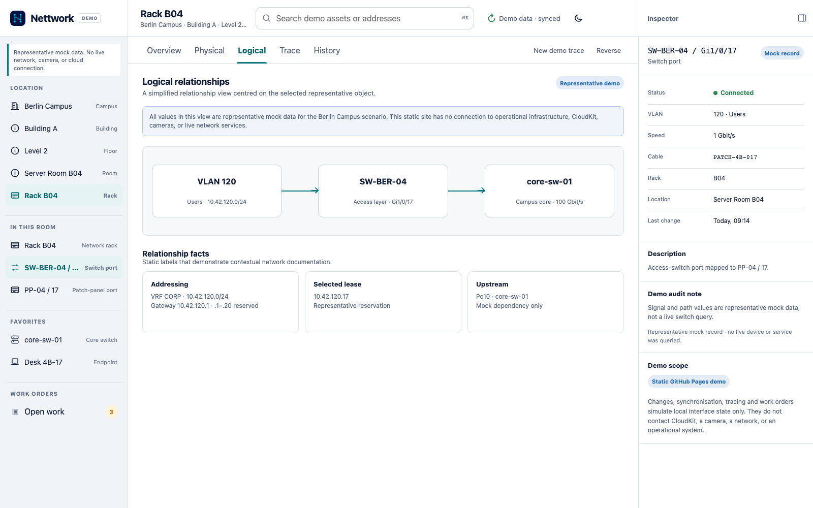
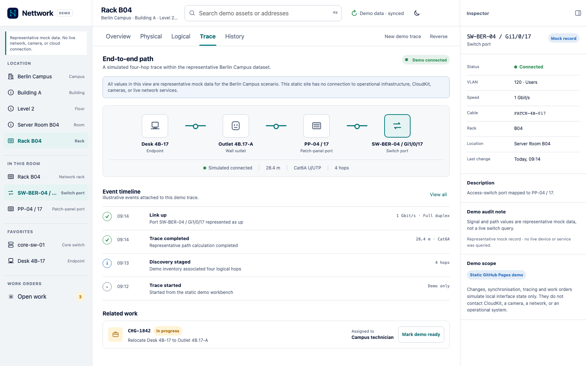
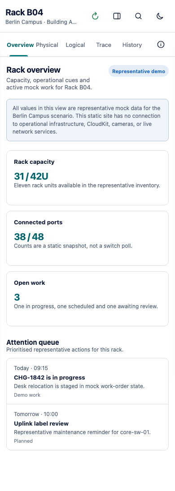

# Nettwork

<!-- markdownlint-disable MD013 -->

Nettwork helps you document what is in a network, where it lives, and how it
connects. It brings equipment inventory, cable paths, racks, floor plans, IP
address management (IPAM), and work orders into a SwiftUI app for iPhone, iPad,
and Mac.

The native app requires an organization-provided CloudKit workspace and
configuration. This repository contains the source and a separate browser demo
with sample data. A default native build opens without a connected workspace;
it is not a ready-to-deploy installation.

[Try the live demo](https://sebastianspicker.github.io/nettwork/) ·
[Screenshot tour](#screenshot-tour) ·
[Build the app](#build-the-native-app) ·
[Configuration](docs/CONFIGURATION.md) ·
[Contributing](CONTRIBUTING.md)

## What it covers

- Browse equipment and ports by location, with racks and floor plans for context.
- Follow physical connections from an endpoint through outlets, panels, and switches.
- Document prefixes, addresses, VLANs, and routing contexts.
- Plan changes through work orders, resource reservations, and audit records.
- Scan asset labels on iOS, enter them manually on macOS, and generate PDF labels.
- Review CSV imports and archive restores before activating them in an empty workspace.

Configured native builds use CloudKit for shared workspace state and SwiftData
for the local mirror and pending changes. See the
[architecture guide](docs/ARCHITECTURE.md) for the data model, authorization,
and synchronization behavior.

## Try the browser demo

Open the [live demo](https://sebastianspicker.github.io/nettwork/) to explore
the sample workspace. It needs no Apple account or native build.

To run the same demo locally, start a server from the repository root with
Python 3:

```sh
python3 -m http.server 4173 --bind 127.0.0.1 --directory site
```

Open <http://127.0.0.1:4173/>. Browse the location tree, select an object, switch
between workbench tabs, and inspect a connection path. Changes stay in browser
memory and reset when you reload.

The demo is maintained separately from SwiftUI. Its inventory, connection
status, event history, and work orders are bundled examples, with no live
network discovery, backend, or CloudKit connection.

## Screenshot tour

These are captures of the **browser demo with sample data**, not the native
app or a live network. Open an image to see it at full size.

### Explore a location

The overview shows rack capacity, connected port counts, and work needing
attention, alongside the location tree and object inspector.



### Inspect the rack

The physical view places equipment in a rack elevation so you can relate an
object to its position and neighboring hardware.



### Read the logical connections

The logical view shows the sample network relationships alongside the selected
object's details.



### Follow a cable path

Trace a sample desk connection through its outlet, patch panel, and switch
port, with path details and event history in view.



### Use a smaller screen

The compact browser layout stacks capacity cards and the attention queue for
smaller screens.

<!-- markdownlint-disable-next-line MD033 -->


## Build the native app

You need macOS, full Xcode with the iOS 18 and macOS 15 SDKs or newer, Swift 6,
and XcodeGen 2.46 or newer. From the repository root:

```sh
make generate
open Nettwork.xcodeproj
```

Choose `Nettwork macOS` to run on Mac or `Nettwork` for an iOS Simulator.
`project.yml` defines the targets and settings; regenerate the project after
changing it. The generated `.xcodeproj` is ignored by Git.

To run the local CI checks, install Node.js 22.13 or newer and the additional
tools listed in [Development](docs/DEVELOPMENT.md), then run:

```sh
npm ci --ignore-scripts --no-audit --no-fund
make verify-source
make verify-package
make verify-native
```

The native gate runs the macOS app tests and builds the iOS Simulator app
without signing. These checks do not require a production CloudKit setup.

## Connect an organization workspace

The default identifiers use `com.example`; no developer team or production
provider is supplied. Running against a real workspace requires registered
bundle IDs, signing, a CloudKit container and schema, storage locations,
access policies, and a configuration provider compiled into the app.

Start with [Production configuration](docs/CONFIGURATION.md). This integration
requires application code as well as build settings. An `.env` file alone does
not configure the app, and an offline startup does not create a usable local
workspace.

## Repository guide

| Path | Contents |
| --- | --- |
| `NettworkApp/` | SwiftUI screens, app composition, and Apple-platform adapters |
| `Packages/NettworkCore/` | Swift libraries for the model, changes, persistence, sync, content safety, transfer, feature contracts, and production workspace services |
| `Tests/App/` | Feature view-model, composition, routing, and platform-adapter tests |
| `site/` | Static browser demo and sample data |
| `Design/Brand/` | Master icon, palette, and asset generation rules |
| `scripts/` | Validation, icon generation, and benchmark tools |

## Documentation

- [Development](docs/DEVELOPMENT.md): setup, commands, tests, and CI.
- [Architecture](docs/ARCHITECTURE.md): modules, data flows, and extension points.
- [Production configuration](docs/CONFIGURATION.md): organization integration and deployment checks.
- [NettworkCore](Packages/NettworkCore/README.md): library products and compatibility contracts.
- [Performance](docs/PERFORMANCE.md): dated local measurements and their limits.
- [Brand assets](Design/Brand/README.md): icon and color maintenance.
- [Contributing](CONTRIBUTING.md): reporting problems and preparing changes.
- [Security](SECURITY.md): sensitive reports and configuration handling.

## License

[MIT](LICENSE).
