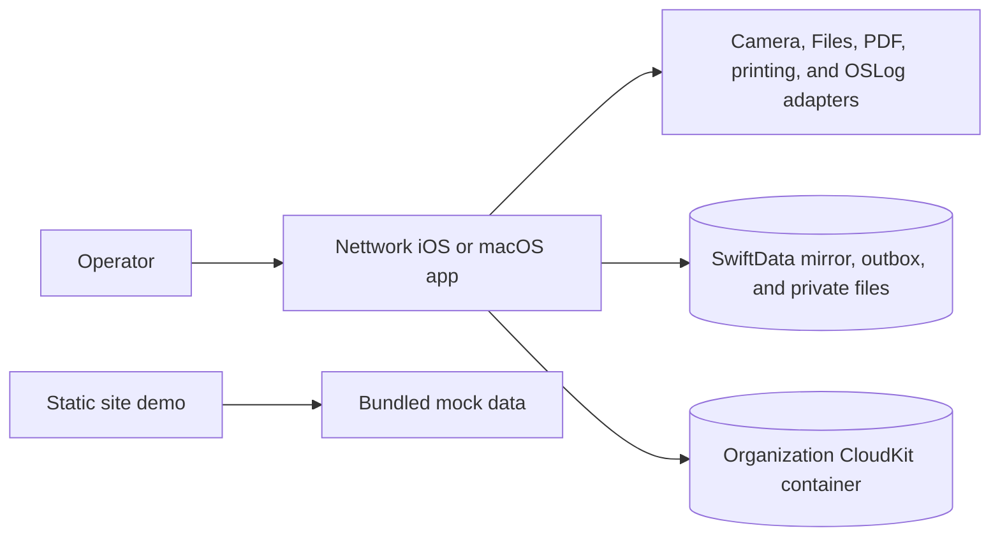
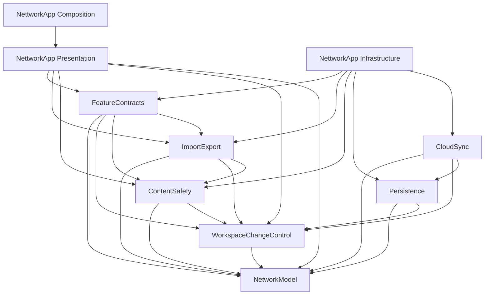
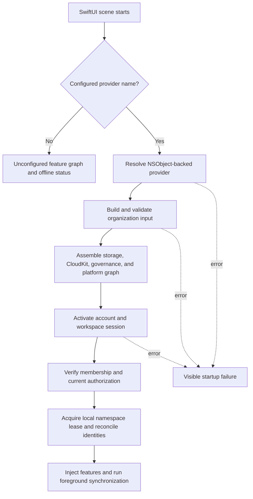

# Architecture

<!-- markdownlint-disable MD013 -->

## System context

Nettwork is a SwiftUI app for documenting network infrastructure in a shared
organization workspace. The native app presents inventory, topology, IPAM,
floor plans, tracing, work orders, labels, reconciliation, administration, and
transfer workflows. It keeps a durable local SwiftData mirror and coordinates
authorized, account-scoped state with CloudKit.

Configured builds store authoritative workspace records in CloudKit. SwiftData
keeps a local copy, pending changes, a search index, and recovery state. Access
to that local state is tied to the current account session. There is no separate
backend server in this repository. The checked-in build has no
organization provider and therefore starts unconfigured rather than creating a
placeholder workspace.

The static demo is a separate artifact. It does not share runtime state or
services with the native app.

## Components and dependency direction

`NettworkCore` contains seven Swift library products. Arrows below point from a
module to a dependency:

The exact package graph is declared in `Packages/NettworkCore/Package.swift`
and enforced by `scripts/check-architecture.sh`. The same check keeps
`NetworkModel` independent of change-control and infrastructure modules and
forbids Presentation from importing CloudKit, SwiftData, `Persistence`, or
`CloudSync`; `FeatureContracts` additionally may not import SwiftUI, UIKit, or
AppKit.

| Component | Responsibility |
| --- | --- |
| `NetworkModel` | Codable and Sendable records, identifiers, topology, hierarchy, templates, tracing, IPAM/VLAN rules, and validation |
| `WorkspaceChangeControl` | Authorized operation contexts, work orders, reservations, planned operations, activation, audit records, and mutation contracts |
| `Persistence` | SwiftData schema history and migration, local mirror, outbox, conflict/quarantine evidence, attachments, and search materialization |
| `CloudSync` | CloudKit transport contracts, remote validation, conditional atomic writes, receipt recovery, staged transfer, sessions, and foreground synchronization |
| `ContentSafety` | Bounded attachment decoding, allowlisting, sanitization, hashing, private staging, quotas, and evidence binding |
| `ImportExport` | Exact CSV schemas, archive formats, bounded parsing, verification, staged transfer, approval, export, and restore |
| `FeatureContracts` | UI-facing service protocols and the snapshot, request, and error values that Presentation consumes and Infrastructure implements |
| `NettworkApp/Presentation` | SwiftUI shell, screens, feature models, view state, and document presentation |
| `NettworkApp/Infrastructure` | Production graph, organization authorities, SwiftData and CloudKit adapters, file operations, and platform bridges |
| `NettworkApp/Composition` | App entry point, feature registry, dependency injection, routing, startup, and shutdown |

## How the app starts

The `NettworkApp` entry point owns a `ProductionAppLaunchController` for the
SwiftUI scene lifetime. Startup is intentionally fail-closed:

Assembly activates and verifies the account-scoped workspace before returning
the production graph. Bootstrap re-runs the idempotent activation boundary
before foreground synchronization. Failure invalidates the current session and
does not expose a permissive local workspace.

The organization provider supplies the `ModelContainer`, private directories,
CloudKit account and container, membership and sharing services, actor and
installation identity, operation policies, authorizations, transfer sources
and destinations, and telemetry stores. Each SwiftUI scene owns a weak iOS
presentation context and supplies system scan and label adapters. An
organization may replace that complete capability set through its assembly
input. See [CONFIGURATION.md](CONFIGURATION.md).

## Data flows

### Foreground synchronization

1. Verify the current account, workspace membership, actor, installation
   session, and local namespace lease.
2. Fetch a bounded remote batch and validate record schemas and references.
3. Apply the entire verified batch atomically to the SwiftData mirror. Rejected
   records are quarantined; the coordinator does not apply a valid subset of an
   invalid batch.
4. Replay eligible outbox work in dependency and shared-resource order.
5. Persist cursor and recovery state and return queue, conflict, quarantine,
   failure, and last-contact signals to the UI.

Account or session changes revoke the old namespace lease and purge ephemeral
state so stale callbacks cannot write into a new workspace.

Incremental search maintenance batches dependency frontiers, projected nodes,
incident edges, and affected entries in deterministic predicates of at most
900 keys. Source and target edge queries remain separate, with results
deduplicated by storage key. Namespace leases, transaction boundaries,
traversal limits, and the full-rebuild fallback remain authoritative.

### Inventory and topology reads

Favorites and recents share one inventory-result batch. The production adapter
uses one mirror projection and materializes inventory rows once, without
loading detail attachments, audit summaries, or traces. History publication is
bound to both session identity and the current history generation.

A successful topology snapshot carries an immutable index from parent IDs to
localized, sorted children. Recursive rows use this index for traversal and
expansion affordances. Physical inventory summaries use an iterative traversal
bounded to 128 explored paths and 512 segments by default; partial results
explicitly identify the limit. The public physical and rich trace APIs retain
their existing contracts.

IPAM validation indexes canonical prefixes by VRF, address family, network, and
length. Address checks examine ancestor prefixes, including reservations in
all containing prefixes. The index is transient and changes no stored schema.

### Controlled mutations and work orders

Presentation submits intent through feature contracts; it never grants
authority. Infrastructure derives current authority from the verified Cloud
session, actor, installation session, workspace lease, and organization policy,
then checks any presentation values for an exact match.

Topology and IPAM changes are staged as work-order operations. The production
authority validates exact current records, reserves affected resources with an
atomic Cloud mutation, obtains a separate server acknowledgement, and enforces
the work-order lifecycle. Execution and completion require a fresh matching
intent and acknowledgement. Completion revalidates model invariants before one
bounded conditional mutation. Cancellation must release reservations or carry
the explicit emergency-override evidence required by policy.

Deletion preconditions are fetched in one CloudKit operation for the bounded
mutation page. Every requested record and change tag must validate before the
atomic mutation proceeds; sentinel fencing remains part of that mutation.
Indeterminate CloudKit writes are resolved through deterministic receipts.
They are not blindly retried.

### Attachments and transfer

Attachment input is read through an opaque, bounded source. The content-safety
service verifies declared type against bytes, rejects unsupported or oversized
content, sanitizes accepted images or PDFs, hashes the result, stages it in a
private directory, and revalidates authorization around staging and binding.
Callers do not receive staging paths.

CSV import and archive restore use a separate activation path:

1. Parse and validate bounded input against exact, versioned formats.
2. Build a canonical candidate and dry-run report.
3. Require current administrator/write authorization and an empty, fresh target
   workspace.
4. Upload invisible staged records in bounded batches and verify their rolling
   digest.
5. Activate the workspace with one final conditional sentinel mutation.

The native CSV directory source reopens bounded byte streams for review and
activation while retaining security-scoped access. A throwing row callback
validates headers and constructs records directly. Raw CSV files and complete
row matrices are not retained together; the bounded domain-record planning
arrays remain part of the transfer contract.

Native archive verification copies and hashes entries into protected private
staging in fixed-size chunks, then closes the selected source. Its descriptor
retains metadata and digests behind an opaque payload handle. The preview owns
that staging until the restore store adopts it. Closing an old preview cannot
delete adopted staging. Terminal failures clean up; retryable failures retain
the durable sidecar under the transfer cleanup policy. Restore consumers read
one verified entry at a time and may materialize an individual entry within
the existing 64 MiB limit. Native upload envelopes retain verified durable-file
capabilities instead of aggregate inline asset bytes. Preflight verification
uses `.verification` beneath the configured archive restore staging root,
separate from operation directories. The in-memory archive interfaces remain
available, including legacy activation authorities.

Archive checksums establish integrity against accidental change; they do not
prove authenticity against a malicious archive writer.

## State ownership

| State | Owner and role |
| --- | --- |
| Authoritative workspace records and mutation receipts | Organization CloudKit private/shared databases |
| Local records, migrations, outbox, conflicts, quarantine, and search index | One namespace-scoped SwiftData store and revocable lease |
| Attachments and transfer staging | Distinct organization-provided private directories |
| Work-order reservations and audit evidence | Cloud-authoritative records mirrored locally |
| Sync and operation telemetry | Privacy-safe aggregate events plus organization-provided retention and metrics stores |
| Static demo state | In-memory browser state seeded only from `site/mock-data.js` |

## External and security boundaries

- The URL route `nettwork://object/<UUID>` uses an opaque object identifier; a
  route identifies an object but does not authorize access.
- CloudKit private and shared databases, account membership, share acceptance,
  subscription state, and schema are organization-owned service state.
- Client role checks are application policy. They do not protect a workspace
  from a hostile participant who independently has write access to CloudKit.
- Administrator authorization is required for privileged transfer and audit
  operations. Authorization is revalidated around sensitive side effects.
- Camera scanning accepts opaque Nettwork identifiers. The iOS scanner and
  label export/printing adapters present only through the owning scene's weak
  presentation context; they never search global application windows. macOS
  deliberately uses manual scan input and native label export/printing. Files,
  PDF, printing, and telemetry integrations remain behind platform or feature
  contracts.
- OSLog telemetry records operational outcomes and aggregates, not customer
  record contents. The organization still owns telemetry storage and retention.
- Local staging paths, signing assets, credentials, production identifiers, and
  organization configuration must not be committed.

## Build and deployment boundaries

`project.yml` is the source of truth for the generated Xcode project. The iOS
and macOS targets compile the same app source and all seven package products, with
platform-specific entitlements and unit-test bundles. `Nettwork.xcodeproj`,
SwiftPM `.build`, DerivedData, test results, and coverage output are generated.

CI runs the source gate and the complete Swift package tests on macOS, then
generates the Xcode project, runs the macOS app test bundle, and builds the iOS
Simulator app. These unsigned checks do not verify production signing, live
CloudKit, or device-only integrations. The separate Pages workflow validates
and deploys only `site/`.

## Placement rules and extension points

| Change | Location |
| --- | --- |
| Topology/IPAM type, invariant, trace, or template rule | `Packages/NettworkCore/Sources/NetworkModel` |
| Work order, reservation, audit, authorization, or mutation contract | `Packages/NettworkCore/Sources/WorkspaceChangeControl` |
| SwiftData model, migration, outbox, local query, or search index | `Packages/NettworkCore/Sources/Persistence` |
| Cloud record, remote validation, session, transport, or sync logic | `Packages/NettworkCore/Sources/CloudSync` |
| Attachment admission, decoding, sanitization, or evidence binding | `Packages/NettworkCore/Sources/ContentSafety` |
| CSV/archive format or staged transfer workflow | `Packages/NettworkCore/Sources/ImportExport` |
| Feature service protocol, snapshot, or request type shared by screens and services | `Packages/NettworkCore/Sources/FeatureContracts` |
| Screen, feature model, or SwiftUI document-picker presentation | `NettworkApp/Presentation` |
| Production composition, file/document adapter, or Apple-platform bridge | `NettworkApp/Infrastructure` |

Add new organization-specific implementations through the production assembly
input and existing feature/platform protocols. Keep organization identities and
policy values outside reusable package modules.

## Scope and limitations

- The repository does not provide a standalone server or a fallback local-only
  production mode.
- The static demo is not a simulator, data migration tool, or service client.
- The local mirror is not an independent authority and must not outlive its
  account-scoped lease.
- The package does not embed an organization CloudKit container, signing setup,
  access policy, deployment process, or credential store.
